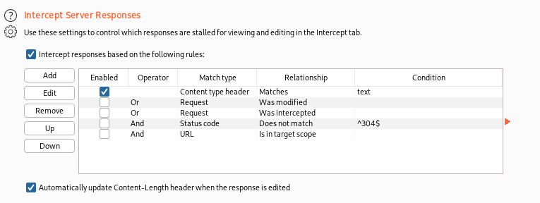

# GET aHEAD

## Table of Matters

[Solution](#Solution)

[Resources](#Resources)

## Details

- **Points:** 20

- **Source:** picoCTF

- **Author:** MADSTACKS

## Description

Find the flag being held on this server to get ahead of the competition http://mercury.picoctf.net:45028/

### Hint 1

Maybe you have more than 2 choices.

### Hint 2

Check out tools like Burpsuite to modify your requests and look at the responses.

## Solution

- The webpage provided by the challenge has two buttons. Clicking on each button toggles between the colors red and blue. Best practice is to check the page source.

- The page source doesn't give us much information aside from the fact that there are two different methods used. "GET" and "POST" which are HTTP Request Methods (You can read more about what it means from the article linked in the resources). The hint is probably referring to another HTTP request method called "HEAD".

- We can try a "HEAD" request using many tools such as Postman or Burpsuite...etc. We'll use Burpsuite to modify our request as suggested by the hint.

- Open up Burpsuite, go to the Proxy tab and under the Intercept tab, put your intercept on. Refresh the challenge webpage and you should get a header that looks like this:

The request intercepted is a GET request.

- Let's modify the "GET" by a "HEAD", click on the "Forward" button and look at the response we got.

- If you don't get a blank page, it must be because your Server Responses aren't configured properly. To do that, you should go to the "Options" tab and under "Intercept Server Responses", check the option "Intercept responses based on the following rules".

- Try forwarding a "HEAD" response again and inspect your response body. We got the flag !

## Resources

- [HTTP Request Methods](https://developer.mozilla.org/en-US/docs/Web/HTTP/Methods)
- [Postman](https://chrome.google.com/webstore/detail/postman/fhbjgbiflinjbdggehcddcbncdddomop)
- [Burpsuite](https://portswigger.net/burp)
